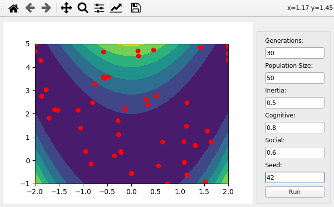

PSO-viz
======

A visualization tool around [PAGMO/PYGMO](https://github.com/esa/pagmo2) library.
It is meant to be used with 2d slices of the objective function. Useful for debuging and for visualization of the algorithm evolution.


### Usage

If you want to use with a specific problem, define your problem using PYGMO interface and pass it to the builder. Example:

```
import pso_viz

class MyProblem:
    def fitness(self, X):
        return [(1.0 - X[0])**2 + 100. * (X[1] - X[0]**2)**2]

    def get_bounds(self):
        return ([-2, -1], [2, 5])

pso_viz.open_gui_for_problem(MyProblem())
```


